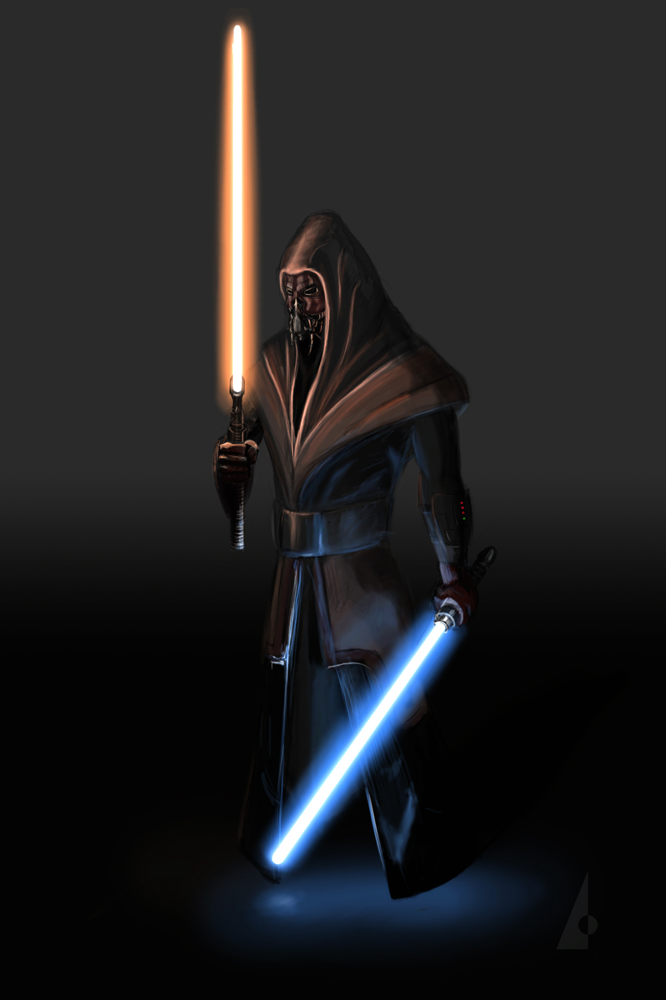

# Darth Vidi

## Biography
Darth Vidi is a male Kel Dor and self-styled "Sith Master". He was raised in the Jedi order but defected believing
that the Jedi's use of only the Light side of the Force was too limited. Believing the Sith to be long dead (and prior
to the re-emergence of Darth Sidious), he declared himself to be a Sith and began amassing knowledge and searching for
an apprentice. He believes in a full embrace of both sides of the Force and carries both a red light saber and a blue
light saber. He relentlessly searches for the lost [homeworld of the Jal Shey](../../locations/jal_shey.md).
