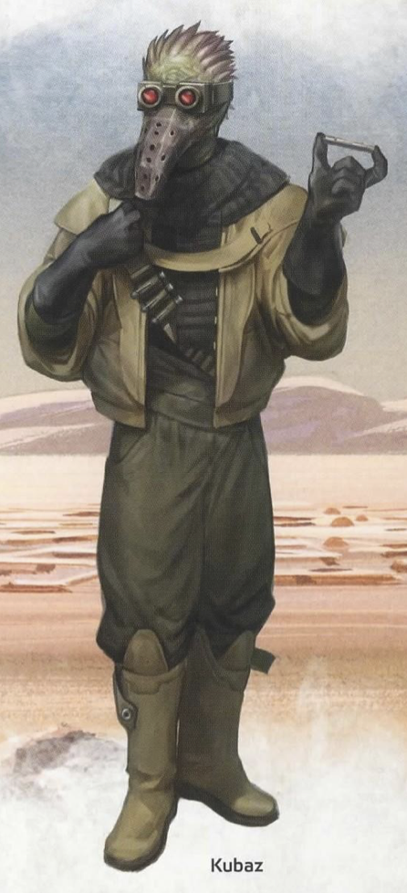

# Hao Norlove

## Biography
Hao Norlove is a kubaz doctor from the planet [Kubindi](../../locations/kubindi.md) who relocated to Coruscant shortly after the Clone Wars began.
He is suspected by the Republic to be selling stolen Republic weapons to separatists. He has so far evaded capture due
to lack of evidence. He resides in a warehouse ostensibly used to house "pharmaceuticals" and enjoys a full-time
private security force. An informant recently leaked shipment manifests to the Republic resulting in an immediate
effort to secure his capture.

## Stat Block
Slaver (EotE p. 394)
