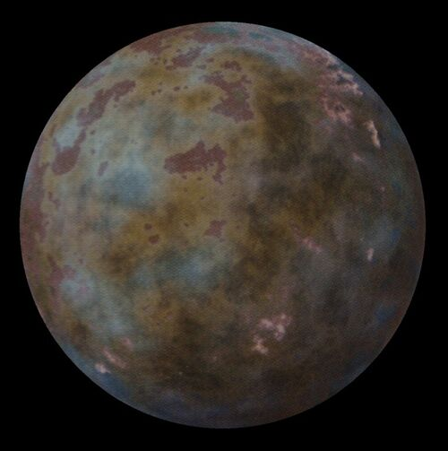

# Kubindi

## Grid Coordinates
T-9

## Item Rarity
4

## Description
Home of the sentient insectivore Kubaz, Kubindi is a forest world largely cut off from the Republic. The Kubaz have
developed the local spaceflight, but hyperdrives have eluded them so far. Therefore, Kubaz found off of Kubindi
are rare. Kubindi is not a formal member of the Galactic Republic nor is considered to be a part of Hutt space.