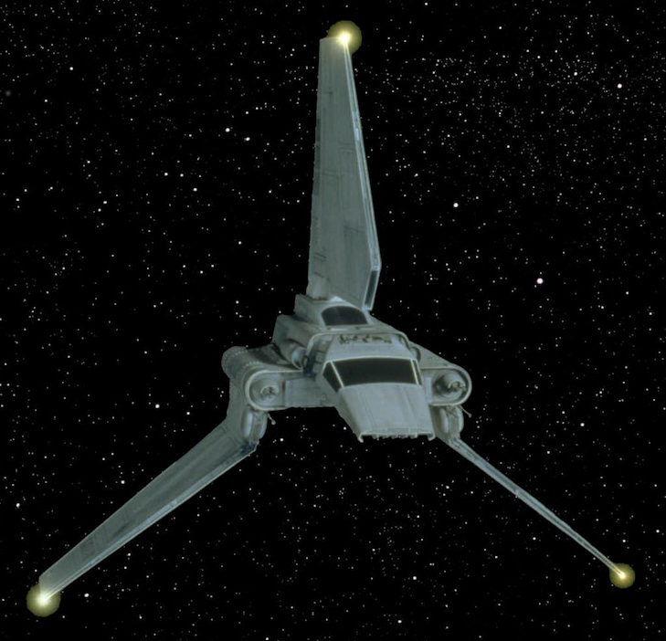

# "Evie"

# Make and Model
Lambda-Class T4-A Long-Range Shuttle

## Stat Block
See p. 260

## Description
Stolen from an Imperial Magnaguard, this unglamorous shuttle has been kept in tip top shape by the Imperial navy.
Stenciled onto the port side of cockpit on the exterior is the ship's name. The shuttle sends a ping containing its
location to its carrier every time it enters or exits hyperspace. Roll a computers difficulty 3 check each time 
to prevent the craft from sending the ping. This can be permanently disabled by a mechanic at a properly
equipped spaceport. If the players choose to do this themselves, it will be a difficulty 5 mechanics check
that can be performed only with the proper equipment and only once per session. A discrete mechanic will
perform this task for 1000-2000 credits. The shuttle will casually appear friendly to Imperial forces, but with any
scrutiny, they will realize that this vessel is stolen.

## Notes
The players had their location pinger disabled on Lantillies for 1,500 Cr.